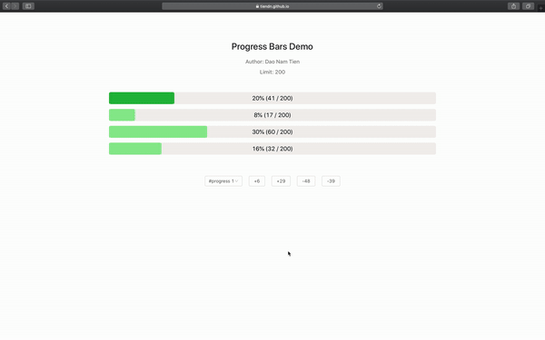

# Front End Assignment - Progress Bars

## 1. Example



## 2. Technical

Some main packages:

- React
- Redux
- Antd
- Scss
- Axios
- @testing-library

Use **[Github Actions](https://github.com/tiendn/progress-bars/actions)** for auto CI/CD

Use Github Pages for display static site, https://tiendn.github.io/progress-bars/

Project was created by [create-react-app](http://create-react-app.dev)

## 3. Descriptions

**Primary task**: Using vanilla JavaScript or any JavaScript library of your choosing (no jQuery), implement the following (you can make it look however you like)

[Example here](http://static.optus.com.au/pei/progress-bars-demo.ogv)

[Endpoint here](http://pb-api.herokuapp.com/bars)

## Requirements

- Must read data from the endpoint
- Multiple bars
- One set of controls that can control each bar on the fly
- Can't go under 0
- Can go over limit (defined in API), but limit the bar itself and change its colour
- Display usage amount, centered
- Write tests for your code (hint: TDD strongly preferred) Implement a responsive solution: testing it on mobile, tablet, etc. Getting it working nicely.
- Animate the bar change, make sure it works well when you tap buttons quickly.
- Version control (git)

Once complete publish your code to github, bitbucket or other git based source control.

Bonus points for implementing "production quality" code, using practices such as:

- Setting it up as a project
- Setting up some automated tools
- Linting, code quality, etc
- JavaScript/CSS minification, packaging, etc Using a CSS preprocessor like SASS/SCSS Styling it to a production quality level

It's up to you to decide how far you want to go, time permitting. Example structure from the endpoint:

```json
{
  "buttons": [10, 38, -13, -18],
  "bars": [62, 45, 62],
  "limit": 230
}
```

## Breakdown

|   Key   |                                                                Description                                                                |
| :-----: | :---------------------------------------------------------------------------------------------------------------------------------------: |
| buttons | The amount of buttons to display and what value they increment or decrement the selected bar. Randomly generates between 4 and 6 buttons. |
|  bars   |            The number of progress bars to display and their default values. Randomly generates between 2 and 5 progress bars.             |
|  limit  |                The equivalent to 100% of each bar. For example, the bar should be 100% filled when the progress hits 230.                 |

Have fun!
